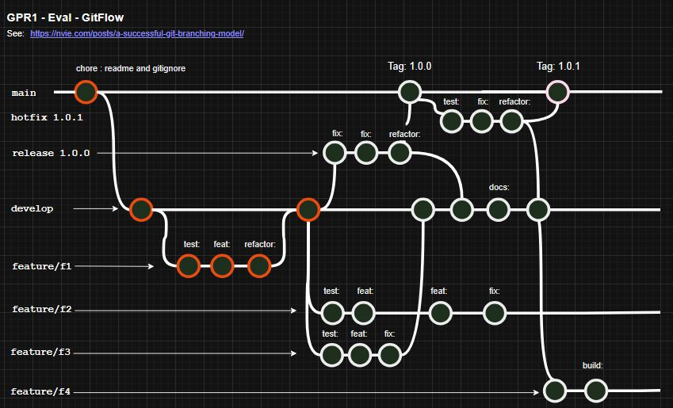
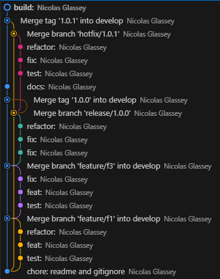

# GRP1 - Evaluation pratique 2025 - Gitflow

## Enoncé

Lors de cette épreuve, nous allons valider les compétences suivantes:

* utilisation des commandes git de base
* application correcte du git-flow (nvie)
* lecture et analyse d'un arbre (tree) produit par git-flow

## Moyens à disposition

| Critère    | Valeur |
| -------- | ------- |
| Accès internet | oui |
| Travail collaboratif, IA | non |
| Temps à disposition | 45 min |

## Pondération et barême

Cette évaluation vaut pour 50% de la note du module.

Le barême est l'habituel [nbPtsObtenus/nbPtsMaximum]/5*1

---

## Préparation de votre environnement

* créez un fork du dépôt transmis via message dans le canal Teams du cours

```
via l'interface graphique de Github
```

!!! Forkez toutes les branches (main et develop)

* "clonez" votre dépôt localement

```
git clone <votreUrl>
```

* validez "l'upstream" ainsi

```
git remote -v
```

* initialisez git-flow

```
git flow init
```

* mettez à jour la branche develop avec le dépôt distant (en étant sur la branche develop)

```
git switch develop
git pull
```

* copiez le fichier "reponse.md" hors de votre dépôt local

## Arbre à obtenir

* Schéma



* Les "commits" rouges sont ceux déjà présents. Les autres sont à produire à l'aide de git.

#### Critères d'évaluation

| Critère    | Valeur | Pondération |
| -------- | ------- | --- |
| Feature F2 | Toutes les étapes sont présentes | 4pts |
| Feature F3 | Toutes les étapes sont présentes | 3pts |
| Release 1.0.0| Toutes les étapes sont présentes | 3pts |
| Develop| Toutes les étapes sont présentes | 1pt |
| Hotfix 1.0.1 | Toutes les étapes sont présentes | 3pts |
| Feature F4 | Toutes les étapes sont présentes | 1pt |
| Chronologie des branches | Selon le schéma draw io   | 10pts |
| Bonnes pratiques de commits (préfixes) | Selon le schéma draw io   | 3pts |
| Bonus | Combien de branches doivent être présentes sur le dépôt distant à la fin ???   | 1pt |

---

## Arbre à obtenir à la fin du travail

```git
git log --graph --oneline --decorate --all
```

```
* e7b9aa2 (HEAD -> feature/f4) build:
*   08c8266 (develop) Merge tag '1.0.1' into develop
|\  
| *   3705ab0 (tag: 1.0.1, main) Merge branch 'hotfix/1.0.1'
| |\  
| | * f9cb959 refactor:
| | * c59f1cb fix:
| | * 30100c1 test:
| |/  
* | b7ac430 docs:
* | d6cd1a8 Merge tag '1.0.0' into develop
|\| 
| *   9a7596c (tag: 1.0.0) Merge branch 'release/1.0.0'
| |\  
| | * d14e3a9 refactor:
| | * 96aeb8b fix:
| | * ddaaded fix:
| |/  
|/|   
* |   ca8fbaf Merge branch 'feature/f3' into develop
|\ \  
| * | 7b640e8 fix:
| * | 7a9a7ee feat:
| * | 5c7e1cc test:
|/ /  
| | * d31cbe5 (feature/f2) fix:
| | * 4d42445 feat:
| | * 7958fab feat:
| | * 5c9cc9a test:
| |/  
|/|   
* |   1ed9fea Merge branch 'feature/f1' into develop
|\ \  
| |/  
|/|   
| * f0c89d7 refactor:
| * 0db9f3d feat:
| * ce72f67 test:
|/  
* fffaf64 chore: readme and gitignore
```



## Modalités de livraison

* Une fois l'exercice terminé, synchronisez correctement votre dépôt local avec votre dépôt distant.
* Vous notifiez votre livraison à l'aide d'un message privé via teams à votre enseignant.
  *  Intégrez le fichier "response.md" qui contiendra les commandes nécessaires pour recréer l'arbre demandé.
  *  Autoévaluation : Mentionnez la note que vous pensez obtenir.
